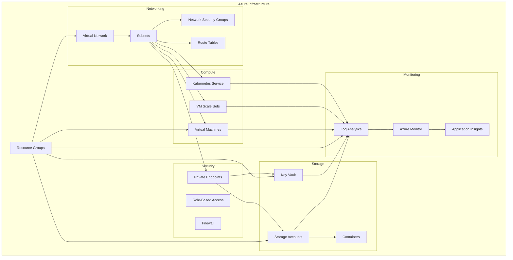
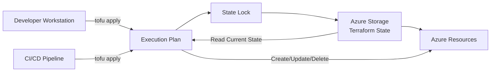
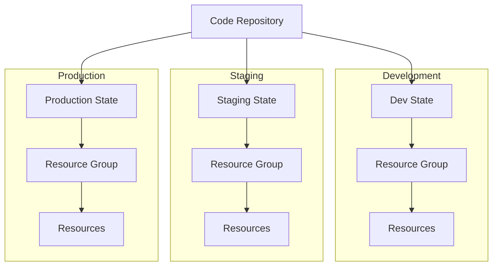
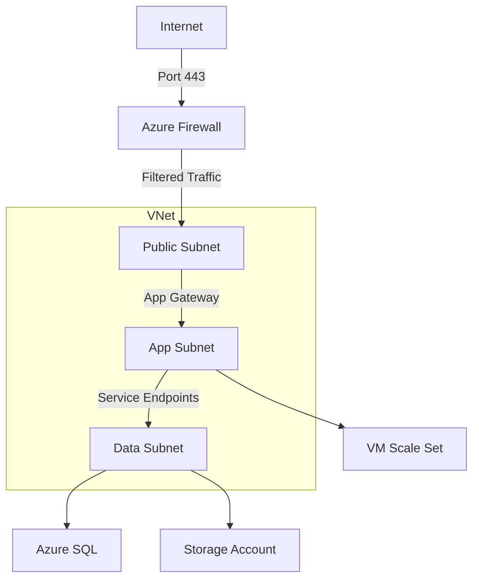

# Infrastructure Architecture Diagrams

## Azure Resource Architecture

```mermaid
graph TD
    subgraph "Azure Infrastructure"
        RG[Resource Groups]
        
        subgraph "Networking"
            VNET[Virtual Network]
            SNET[Subnets]
            NSG[Network Security Groups]
            RTB[Route Tables]
        end
        
        subgraph "Storage"
            ST[Storage Accounts]
            CONT[Containers]
            KV[Key Vault]
        end
        
        subgraph "Compute"
            VM[Virtual Machines]
            VMSS[VM Scale Sets]
            AKS[Kubernetes Service]
        end
        
        subgraph "Security"
            RBAC[Role-Based Access]
            PE[Private Endpoints]
            FW[Firewall]
        end
        
        subgraph "Monitoring"
            LAW[Log Analytics]
            AM[Azure Monitor]
            AI[Application Insights]
        end
    end
    
    RG --> VNET
    RG --> ST
    RG --> VM
    RG --> KV
    RG --> LAW
    
    VNET --> SNET
    SNET --> NSG
    SNET --> RTB
    
    SNET --> PE
    PE --> ST
    PE --> KV
    
    ST --> CONT
    
    SNET --> VM
    SNET --> VMSS
    SNET --> AKS
    
    VM --> LAW
    VMSS --> LAW
    AKS --> LAW
    ST --> LAW
    KV --> LAW
    
    LAW --> AM
    AM --> AI
```

## State Management

```mermaid
graph LR
    DEV[Developer Workstation] --> |tofu apply| PLAN[Execution Plan]
    CICD[CI/CD Pipeline] --> |tofu apply| PLAN
    
    PLAN --> LOCK[State Lock]
    LOCK --> STATE[Azure Storage<br/>Terraform State]
    STATE --> |Read Current State| PLAN
    
    STATE --> AZURE[Azure Resources]
    PLAN --> |Create/Update/Delete| AZURE
```

## Multi-Environment Setup

```mermaid
graph TB
    subgraph "Development"
        DEV_STATE[Dev State]
        DEV_RG[Resource Group]
        DEV_RESOURCES[Resources]
    end
    
    subgraph "Staging"
        STG_STATE[Staging State]
        STG_RG[Resource Group]
        STG_RESOURCES[Resources]
    end
    
    subgraph "Production"
        PROD_STATE[Production State]
        PROD_RG[Resource Group]
        PROD_RESOURCES[Resources]
    end
    
    CODE[Code Repository] --> DEV_STATE
    CODE --> STG_STATE
    CODE --> PROD_STATE
    
    DEV_STATE --> DEV_RG
    DEV_RG --> DEV_RESOURCES
    
    STG_STATE --> STG_RG
    STG_RG --> STG_RESOURCES
    
    PROD_STATE --> PROD_RG
    PROD_RG --> PROD_RESOURCES
```

## Network Security Model

```mermaid
graph TB
    INTERNET[Internet] --> |Port 443| FW[Azure Firewall]
    
    FW --> |Filtered Traffic| PL[Public Subnet]
    PL --> |App Gateway| APP[App Subnet]
    APP --> |Service Endpoints| DAT[Data Subnet]
    
    subgraph "VNet"
        PL
        APP
        DAT
    end
    
    APP --> VM[VM Scale Set]
    DAT --> DB[Azure SQL]
    DAT --> ST[Storage Account]
``` 