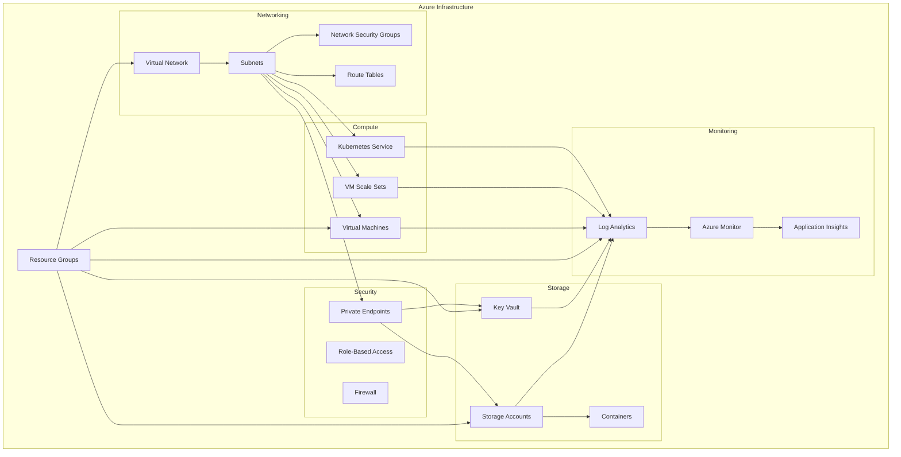
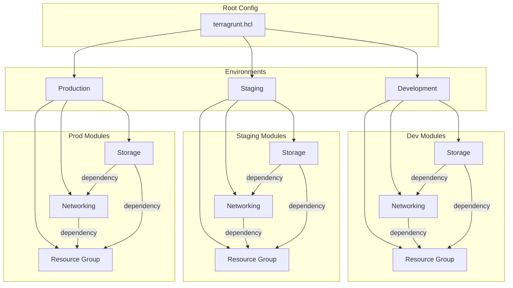
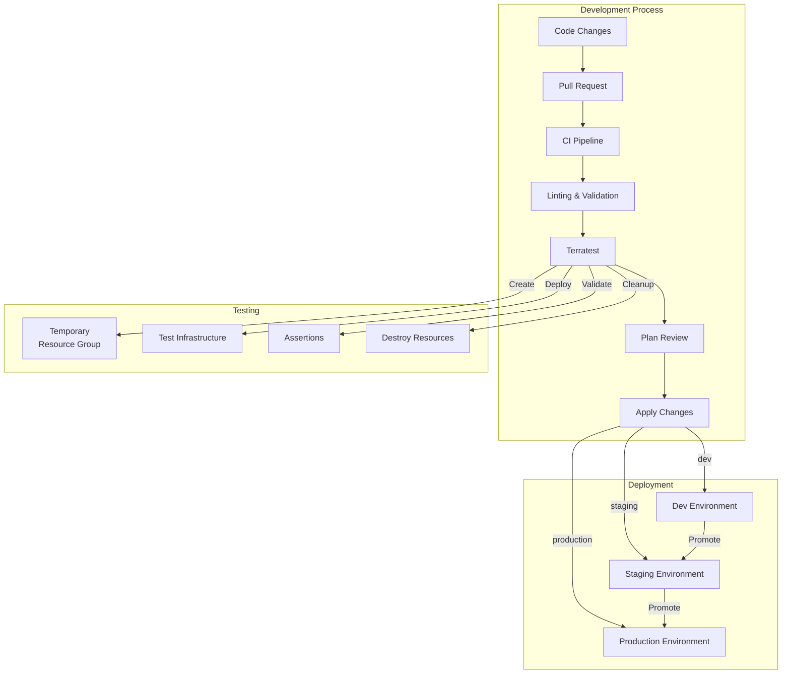
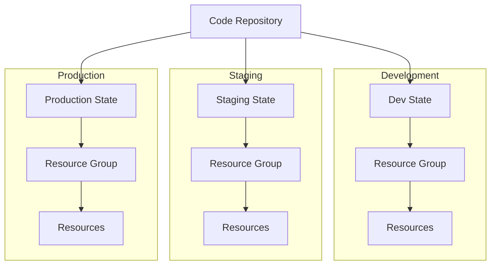
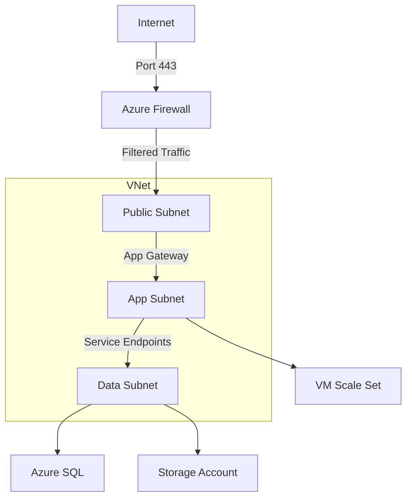

# Infrastructure Architecture Diagrams

## Azure Resource Architecture

## Terragrunt Structure

## State Management

## Terragrunt & Terratest Workflow

## Multi-Environment Setup

## Network Security Model

